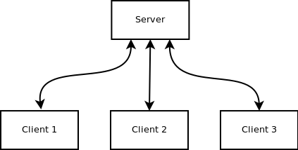

# PySyncIt

PySyncIt is a simple tool to keep folders in sync between machines connected on a network.
The main purpose of writing this application is to keep my two laptops in sync. Currently,
it supports any number of clients and all of them will be kept in sync. At
the core of this application, all files are transferred over the network using
'scp'.

The focus of application's design has been to cover this basic use-case and cover it well. I have tried to take
care of the corner issues that could arise.

Right now, some useful features are implemented in this application.
1. You can specify any number of folders to sync.

At this point, this application has many limitations. But, due to the design of this application, I believe it shouldn't require much
effort to get rid of these limitations.

1. No versioning: In case of collision, only the latest file will be kept.
2. Only files(and not subfolders) inside this specified folder will be synced


## Running PySyncIt

PySyncIt is written only for Linux (tested for Ubuntu).

### Dependency

All you need is python installed on your system and you are ready to go. However, there may be some python modules that you need to install.

External Python Modules:

```
pyinotify
```

### Getting Started

1. Install dependency:
```
sudo apt-get install python-pyinotify
```
1. git clone
```
git clone git@github.com:db42/PySyncIt
```

2. Choose machine to act as server and client machines to sync

3. On each client/server machine

    * Setting up configuration file - syncit.cfg.
    Sample configurations have been provided to set various parameters (username, ip address and port) of server and client machines.
    * execute monitor.py
    ##### Client
    ```
    python monitor.py -ip 172.16.1.160 -port 8082 -uname dushyant -role client
    ```
    ##### Server
    ```
    python monitor.py -ip 172.16.1.160 -port 8081 -uname db42 -role server
    ```

#### How PySyncIt Works : Application Logic:



The application works on simple client/server design concept. Different machines
that are to be kept in sync will behave as clients and, either one of them or a
completely different machine will play the role of a server.
Clients never interact with each directly; every communication is between server
and a client.

The overall working of this application can be divided into two parts:

CLIENT:

* Finding modified files:
Each client runs a separate thread to keep track of all the files that get modified or created.

* Syncing those files:
A separate thread pushes those modifed files to the server using 'scp'.


SERVER:

* Receives modified files from a client and ask other clients to pull that file.


#### Code Structure:
1. syncit.cfg: Configuration file.

2. Node.py contains the base class for Server and Client. Server.py and Client.py extends the base class.

3. rpc.py: helper class for rpc functions.

4. PersistentSet.py: Implements persistent data structure using pickle.
